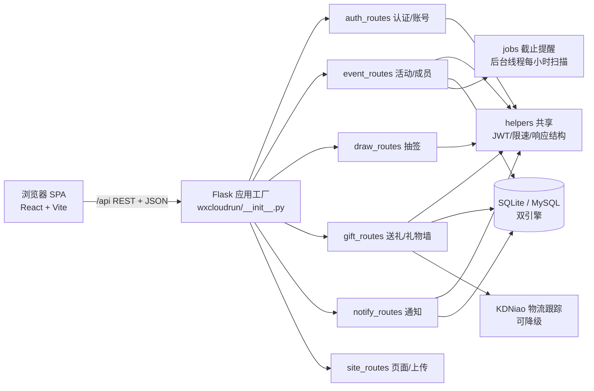

# 礼物互赠 · Gift Exchange 🎁

**好友之间组织「礼物交换」的 Web 应用**：建一个活动、拉人进来、自动抽签配对，大家匿名互送礼物、晒图分享，全程有进度有提醒。

前后端一体：Flask（Python）REST API + React 18（Vite/TS）单页应用，开箱即用（SQLite），生产可切换 MySQL，支持 Docker 一键部署与 PWA 离线使用。

## 核心功能

- **30 秒建活动** — 创建即生成邀请短码 + 分享链接；游客打开落地页即可了解活动、登录后一键加入
- **智能抽签** — 随机送礼环算法：防自抽、支持互避规则（不想送谁就不送谁）、无解预判、组织者可随时重抽
- **报名心愿单** — 加入时填写收件信息 + 「喜欢 / 避雷 / 备注」，个人资料保存后新活动自动预填
- **礼物进度条** — 待购买 → 已发货 → 已签收 → 已晒图，四步状态机；填快递单号自动跟踪物流（KDNiao，失败自动降级可重试）
- **晒图礼物墙** — 公开照片 / 模糊照片 / 仅文字三种隐私形态，全员晒完自动解锁礼物墙 + 点赞
- **通知中心** — 截止提醒（48h/24h）、抽签结果、发货、晒图、催办，全部站内信 + 偏好开关 + 批量已读/清空
- **组织者仪表盘** — 成员完成度一览（收件信息/发货/晒图）、一键催办、归档/恢复活动
- **账号安全** — JWT 登录、忘记密码（短信码式 6 位数字码）、账号注销（匿名化）、个人数据导出

> 截图示例：`ui-shots/01-home.png`（更多见 `ui-shots/`、`.audit/*-shots/`）

## 快速开始（3 步）

```bash
# 1. 安装依赖（Python 3.11+；前端可选，仅改前端时需要）
pip install -r requirements.txt

# 2. 启动（无 MySQL 时自动用本地 SQLite: data/gift_exchange.db）
export JWT_SECRET="$(openssl rand -hex 32)"
python run.py 0.0.0.0 8080

# 3. 打开玩
open http://127.0.0.1:8080
```

体验/演示数据（幂等，可重复执行）：

```bash
python3 scripts/seed_demo.py
# demo_alice / demo_bob / demo_carol，密码 Demo1234；含示例活动、抽签结果、物流、晒图、通知
```

测试账号（有真实历史数据）：`verify_user / Verify123`

## 技术栈

| 层 | 技术 |
|---|---|
| 后端 | Python 3.11 · Flask · gunicorn · JWT（自实现 HS256） |
| 数据 | SQLite（默认，WAL）/ MySQL（生产），双引擎同一套通用 SQL |
| 前端 | React 18 · TypeScript · Vite · Design Tokens（`--gift-*` CSS 变量）· PWA |
| 部署 | Docker（多阶段构建）· docker-compose · 微信云托管兼容 · Procfile |
| 外部服务 | KDNiao 物流查询（可关，失败降级） |
| 质量 | pytest（250 用例）· GitHub Actions CI · Puppeteer E2E · 压测/可观测性 |

## 架构一图流



后端按域拆分为 8 个模块（Blueprint），跨模块逻辑收敛在 `helpers.py`；详细设计见 **[docs/ARCHITECTURE.md](docs/ARCHITECTURE.md)**。

## 质量与测试

- **pytest 250 项全绿**（`PYTHONPATH=. python3 -m pytest tests -q`），覆盖：抽签纯函数、双引擎迁移、并发竞态、权限边界、异常路径、运维脚本、安全加固
- **E2E 端到端**：主旅程 48 步 + 场景扩展 59 断言（Puppeteer，`.audit/`）
- **专项审计**：安全、UX、性能（9 接口 4–5ms）、压测、稳定性、移动端、无障碍、浏览器兼容矩阵、i18n —— 报告索引见 `.audit/REPORTS_INDEX.md`
- **CI**：GitHub Actions 全绿

## 文档导航

| 文档 | 内容 |
|---|---|
| [docs/API.md](docs/API.md) | 全部 49 个 REST 接口：方法/路径/权限/参数/响应 |
| [docs/ARCHITECTURE.md](docs/ARCHITECTURE.md) | 模块图、数据模型、关键机制（抽签/状态机/通知/限速/迁移） |
| [DEPLOY.md](DEPLOY.md) | 生产部署（Docker/MySQL/CORS/备份/运维 cron） |
| [ROADMAP.md](ROADMAP.md) | 路线图 v5（全部完成）与 hackathon 各轮成果 |
| [CHANGELOG.md](CHANGELOG.md) | 变更日志（按波次，含 commit） |
| [JOURNEY.md](JOURNEY.md) | 用户旅程与开发进度记录 |
| `.audit/REPORTS_INDEX.md` | 15 份审计报告索引 |

## 开发速查

```bash
# 前端构建（改前端后必须：build → 重启 Flask，否则白屏）
cd frontend && npm run build

# 重启服务
lsof -ti :8080 | xargs kill; bash /tmp/gift_run.sh
```

运维脚本（备份/清理/核查，用法见 DEPLOY.md「数据运维」）：`scripts/backup_db.sh`、`cleanup_orphans.py`、`cleanup_notifications.py`、`healthcheck_data.py`。

## License

MIT — 见 [LICENSE](LICENSE)。
