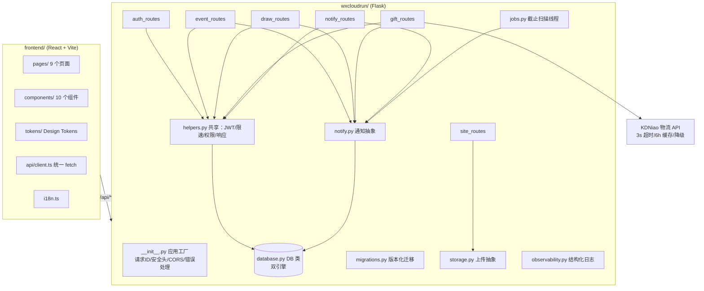
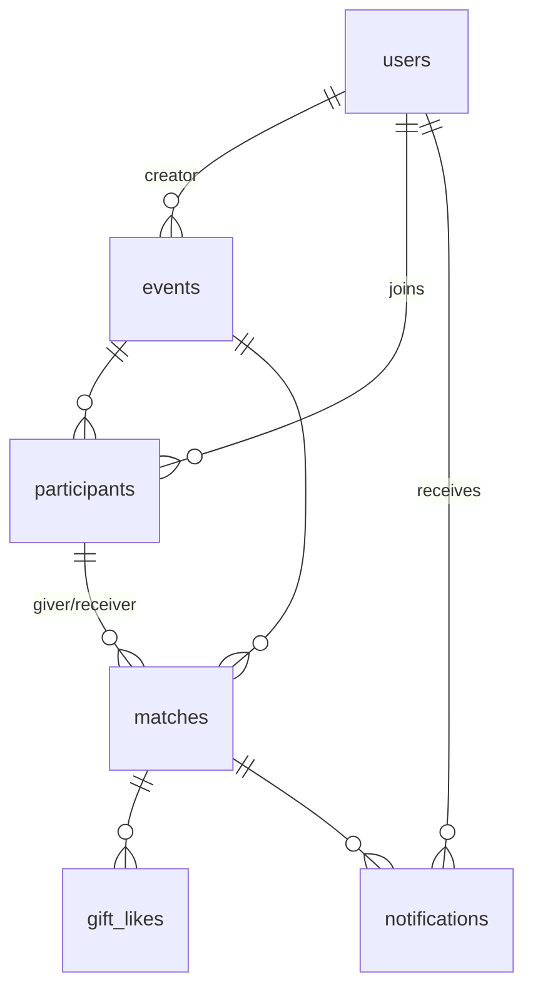

# 架构设计 — giftexchange

> 面向：新加入的开发者。读完能回答「这个项目怎么组织的、数据长什么样、关键机制怎么工作」。
> 配套：[API.md](API.md)（接口全量）、[DEPLOY.md](../DEPLOY.md)（部署）、[README.md](../README.md)（总览）。

## 1. 总览

单体应用，前后端同仓库部署：

- 后端：Python 3.11 + Flask 应用工厂（`wxcloudrun/__init__.py`），按业务域拆 Blueprint，REST + JSON，`ok()/fail()` 统一响应结构 `{code, data, message}`（`response.py`）。
- 前端：React 18 + Vite + TS 单页应用（`frontend/`），构建产物输出到 `wxcloudrun/static/` + `templates/index.html`（SPA 由 Flask 托管，同源部署，无跨域）。
- 数据：SQLite（默认，WAL）/ MySQL（生产）。同一套参数化 SQL（`?` 占位），`database.py` 的 `DB` 类负责方言切换（MySQL 下 `?` → `%s`），业务代码不感知引擎差异。

## 2. 后端模块（8 个路由域 + 支撑层）

| 模块 | 职责 | 关键内容 |
|---|---|---|
| `auth_routes.py` | 注册/登录/忘记密码/改密/注销/数据导出 + 个人资料 + 管理设置 | JWT 签发校验、PBKDF2 150k 轮、6 位重置码、注销匿名化、`admin_required` |
| `event_routes.py` | 活动 CRUD、成员加入/退出、参与者状态、催办、仪表盘、归档、短码重置 | 活动流程状态推导、`add_participant` 共用路径 |
| `draw_routes.py` | 抽签/重抽/查看匹配 | 调用 `draw.py` 纯函数，事务内删旧建新 |
| `gift_routes.py` | 晒图（评/晒/删）、礼物墙、点赞、悄悄话、发货、物流刷新 | 送礼状态机推导、KDNiao 封装调用 |
| `notify_routes.py` | 通知列表/已读/清空/偏好 | 委托 `notify.py` |
| `site_routes.py` | `/` SPA、静态资源、PWA（manifest/sw）、图片上传、健康检查 | 魔数校验上传 |
| `helpers.py` | 共享：`ok/fail`、`login_required/admin_required`、`fetch_event`、短码生成+限速、通知兼容包装 | **跨模块唯一共享层，禁止重复实现** |
| `database.py` | 连接、方言切换、建表、历史迁移入口 | 双引擎 schema 同一份声明 |

支撑层（非路由）：`auth.py`（JWT/PBKDF2）、`draw.py`（抽签纯函数）、`notify.py`（通知偏好过滤+去重）、`jobs.py`（截止提醒扫描）、`migrations.py`（版本化迁移）、`storage.py`（存储抽象）、`observability.py`（request_id + 结构化 JSON 日志）、`response.py`（ok/fail）。

### 前端结构（`frontend/src/`）

- `pages/` — LoginPage、RegisterPage、ForgotPasswordPage、EventsPage、EventDetailPage、CreateEventPage、GiftWallPage、DashboardPage、ProfilePage
- `components/` — Header、Modal、Toast、Badge、ImageUpload、SharePoster/PosterModal（Canvas 海报）、SafeImage（图片降级）、ErrorBoundary
- `tokens/` — Design Tokens 三层：primitive → semantic → component，CSS 变量 `--gift-*` + TS 常量同源生成；**业务代码禁硬编码色值**
- `api/client.ts` — 统一 fetch 封装（带 JWT、统一错误处理）
- 分包：页面/海报组件懒加载（主 bundle gzip ≈ 64 KB）

## 3. 数据模型

核心 6 表 + 2 辅助表。所有表双引擎同构，外键行为一致（SQLite `REFERENCES` / MySQL `FOREIGN KEY`）。

| 表 | 关键字段 | 说明 |
|---|---|---|
| `users` | username/email（唯一）、password（PBKDF2）、display_name、收件三件套（receiver_name/phone/address）、gift_preference、is_admin、notification_prefs（JSON）、reset_code(+expires)、deactivated、openid/unionid/session_key（微信预留） | 注销不物理删除，匿名化 + `deactivated=1` |
| `events` | code（uuid 唯一）、short_code（6 位邀请短码）、name、budget_min、status、match_visibility、sign_up_deadline、participant_count、is_public、max_participants、cover_image、excluded_pairs（互避 JSON）、archived | 创建者自动成为参与者 |
| `participants` | event_id+user_id 唯一、nickname、收件信息、preference_likes/dislikes/notes | 报名即写入，join 与资料预填共用路径 |
| `matches` | event_id、giver_id、receiver_id（均指向 participants）、note（悄悄话）、shipment_status/carrier/tracking_number/tracking_summary、received_at、gift_rating/review/photo_url、gift_privacy（photo/text/blur） | 一条 = 一个送礼任务；重抽先删后建 |
| `notifications` | user_id、event_id、match_id、type、title/message、read_at | type 驱动偏好过滤与去重 |
| `gift_likes` | match_id+user_id 唯一 | 礼物墙点赞 |
| `app_settings` | key_name/value | 站点设置（site_name、registration_enabled、shipment_tracking_enabled），env 兜底 |
| `schema_migrations` | version | 版本化迁移记录 |

## 4. 关键机制

### 4.1 抽签（`draw.py`，纯函数）

- 算法：`secrets.SystemRandom` 洗牌 → 校验环（每人恰好送出一人、收到一人；相邻两人不互避、不自送）→ 最多 200 次尝试，成功返回合法环，失败返回无解信号。
- 可解性预判（`is_draw_solvable`）：n ≥ 4 时任意互避集理论上可解；n = 3 时存在任一互避对即无解（三人环任意两人必相邻）；n = 2 恒无解。
- 幂等与并发：仅组织者、仅 `open` 状态可抽；`redraw` 仅组织者、仅 `drawn` 状态，事务内 `DELETE` 旧 matches（级联清点赞/通知）后重建，状态不变。

### 4.2 活动状态机（事件级）

- 存储状态：`open`（报名中）→ `drawn`（已抽签）。归档独立标记 `archived`（软删除），`open` 活动归档 = 直接删除。
- 推导流程状态（`derive_flow_state`，事件详情用）：`recruiting`（open 未截止）→ `drawing`（open 已过截止未抽签）→ `active`（drawn 未全晒）→ `completed`（drawn 且全部 posted）。
- 约束：截止后/已抽签拒绝新加入；创建者不能退出；已抽签不能退出。

### 4.3 送礼状态机（match 级）

- 阶段（`shipment_state` 推导）：`purchase`（待购买）→ `shipped`（已发货）→ `received`（已签收）→ `posted`（已晒图）。
- 存储：`shipment_status`（pending/shipped/delivered）+ `received_at` + 晒图三字段（rating/review/photo_url）→ posted。
- 物流：填单号触发 KDNiao 查询（配置关闭或失败自动降级文案）；`POST shipment/refresh` 供失败重试，不重复通知。

### 4.4 通知（`notify.py`）

- 统一入口 `notify(db, user_id, event_id, match_id, type_name, title, message)`；未来接微信订阅消息只改此适配点。
- 偏好过滤：`PREF_BY_TYPE` 把 type 映射到用户 `notification_prefs`（JSON，缺省全开）——`deadline_48h/24h → deadline`、`draw_result/draw_redraw → draw`、`gift_posted/gift_wall_unlocked → giftReceived`、`participant_joined/shipment_sent → remind`；`join_success` 等未归类 type 不拦截。
- 一次性提醒去重：`_reminder_sent` 按 event_id + type（`deadline_48h`/`deadline_24h` 编码小时）查重，同活动只发一次。
- 后台线程（`jobs.py`）：每小时扫描 open 活动，截止前 48h/24h 给组织者发提醒。

### 4.5 限速（内存级，线程安全）

- 忘记密码：`_forgot_attempts` 按 `(client_ip, account)` 计数，超限 429（重置码 15 分钟有效、单用户单码、新码覆盖旧码）。
- 短码查找：`short_code_rate_limited(ip)` 按 IP 统计失败次数，达上限 429（`ShortCodeRateLimited` 异常 → 统一 429 处理器）。

### 4.6 迁移（`migrations.py`）

- 版本化：`MIGRATIONS` 列表（当前 v1–v11），每条含 version/name/up，`schema_migrations` 表记录已应用版本。
- 幂等双保险：每个 ALTER 前 `_column_exists`/`_index_exists` 守卫（MySQL 走 information_schema、SQLite 走 pragma/sqlite_master），老库重跑不报错。
- **纪律：新列/新表/新索引一律 append 新版本（version +1），禁止修改历史 CREATE TABLE。**

### 4.7 安全

- 密码 PBKDF2-SHA256 150k 轮；JWT HS256（`JWT_SECRET` 必填 fail-closed，7 天 TTL）。
- 上传：storage.py 魔数校验（PNG/JPEG/GIF 文件头）+ 5MB 上限 + 扩展名白名单 + 防路径穿越；图片字段存 URL 不存 base64。
- 响应头：nosniff / X-Frame-Options DENY / Referrer-Policy / CSP；CORS 仅回显配置的 Origin。
- 权限矩阵：组织者专属（编辑/删除/归档/重抽/催办/仪表盘/重置短码）、本人专属（晒图/悄悄话/发货）、参与者或组织者（礼物墙）、公开活动对登录用户可见。
- 可观测性：每请求 `X-Request-ID` 透传 + 结构化 JSON 日志（`observability.py`），错误详情绝不进响应体。

### 4.8 微信生态接入规划（预留，未实现）

> 状态：**仅代码预留 + 接入路径说明，本轮未实现、未引微信依赖、无假接口**。

**已就位的前置（改代码即可接）**

- `users` 表已含 `openid` / `unionid` / `session_key` 三列（migrations.py v5「微信字段预留」），写路径可直接 `UPDATE users SET openid=?` / 注册时 INSERT 携带；后续如需「一个微信账号一个本地账号」，用新迁移（version +1）给 `openid` 加唯一索引即可。
- 通知层已预留适配点：`notify.py` 统一入口，未来接微信订阅消息只改该模块（见 4.4）。
- 注册开关已前后端打通：`GET /api/site/config`（公开）返回 `registration_enabled`，登录页据此隐藏「立即注册」入口，注册页 403 → 提示「注册暂未开放」（`site_routes.py` + `LoginPage.tsx` + `RegisterPage.tsx`）。

**接入路径（微信开放平台）**

1. 注册微信开放平台账号，创建小程序/公众号，拿到 `AppID` / `AppSecret`；域名加入小程序 request 合法域名（同源部署，`/api/*` 已在）。
2. 前端 `wx.login()` 取一次性 `code`，调新后端接口 `POST /api/auth/wechat-login`（如 `{code, nickname?, avatarUrl?}`）。
3. 后端用 `AppID + AppSecret + code` 请求微信 `code2session`（`https://api.weixin.qq.com/sns/jscode2session`）换 `openid` / `session_key` / `unionid`；code 一次性、5 分钟有效，需防重放。
4. 落库绑定：按 `openid` 查 `users`；命中 → 静默登录（签发 JWT）；未命中 → 创建本地账号（`username` 用微信昵称+随机后缀、`password` 置不可登录随机串、`is_admin=0`）或引导绑定已有账号。`session_key` 仅服务端持有，加密或内存缓存，不下发前端。
5. 登录态延续现有 JWT 体系（`sign_token` / `login_required`），前端 `api/client.ts` 未来小程序迁移替换为 `wx.request` 适配层即可。

**约束红线**

- 不硬编码 AppID/Secret：走 `ADMIN_*` 同款 env / `app_settings` 机制（secret 类型）。
- 微信 API 依赖外网：接入时沿用 KDNiao 的封装模式（超时 + 失败降级文案 + 日志），不阻塞主流程。
- 不往 DB 存 base64；头像等文件仍走 `/api/upload`。

